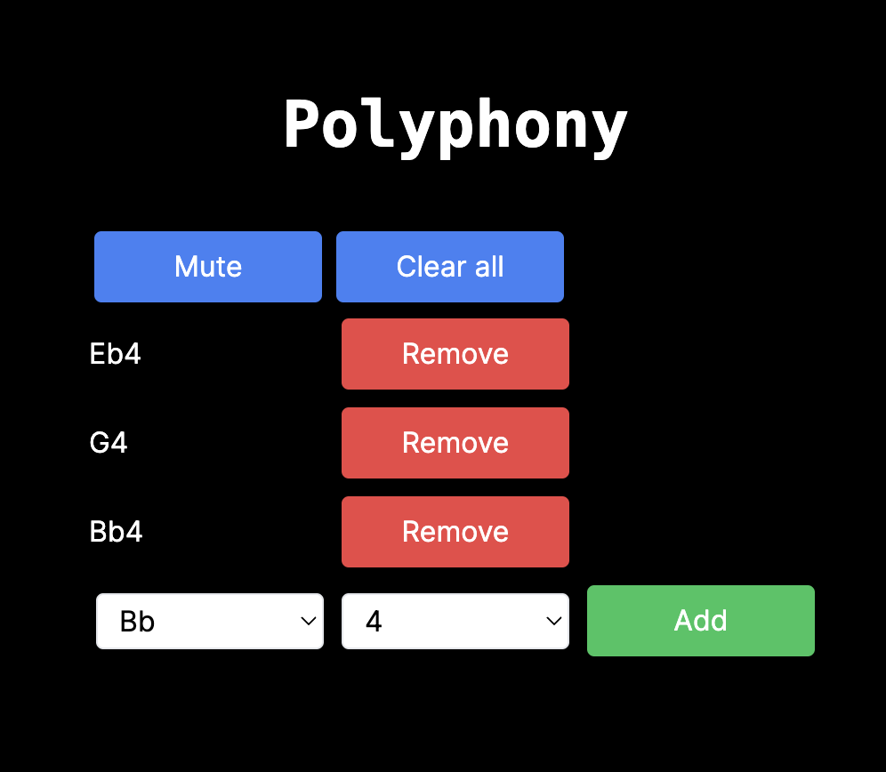

# Polyphony




## What is this?

This is a [Next.js](https://nextjs.org/) project bootstrapped with [`create-next-app`](https://github.com/vercel/next.js/tree/canary/packages/create-next-app). It uses the [Tone.js](https://tonejs.github.io/) library to play a few sounds  at the same time.

It is deployed to [https://polyphony.vercel.app/](https://polyphony.vercel.app/).

## Local Dev

```bash
npm run dev
```
Open [http://localhost:3000](http://localhost:3000) 
